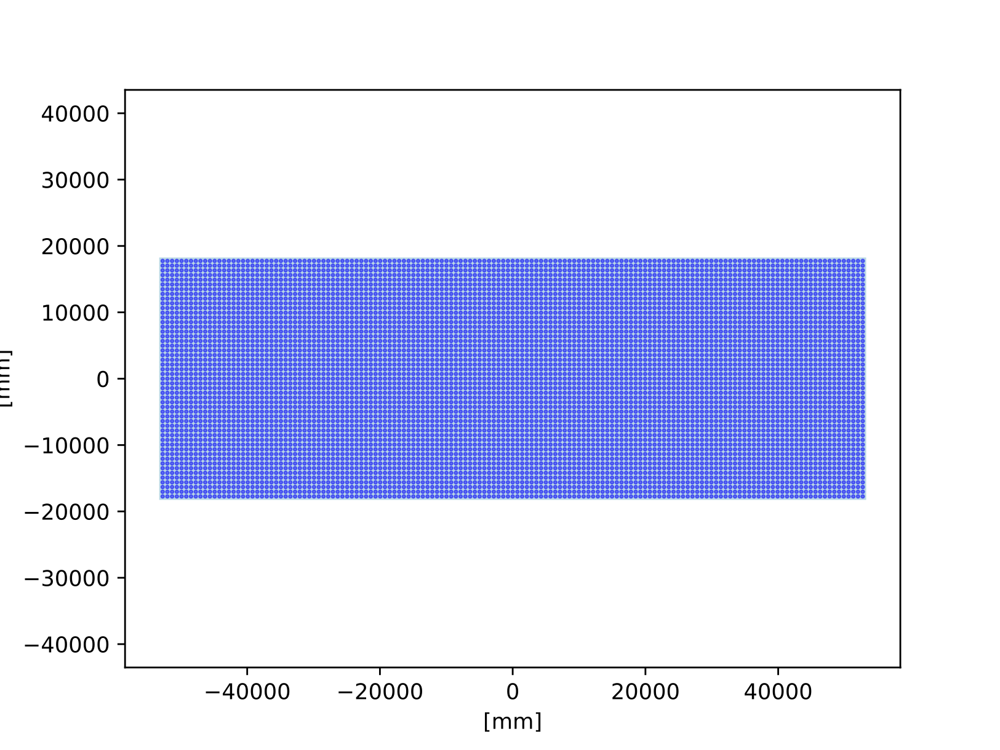
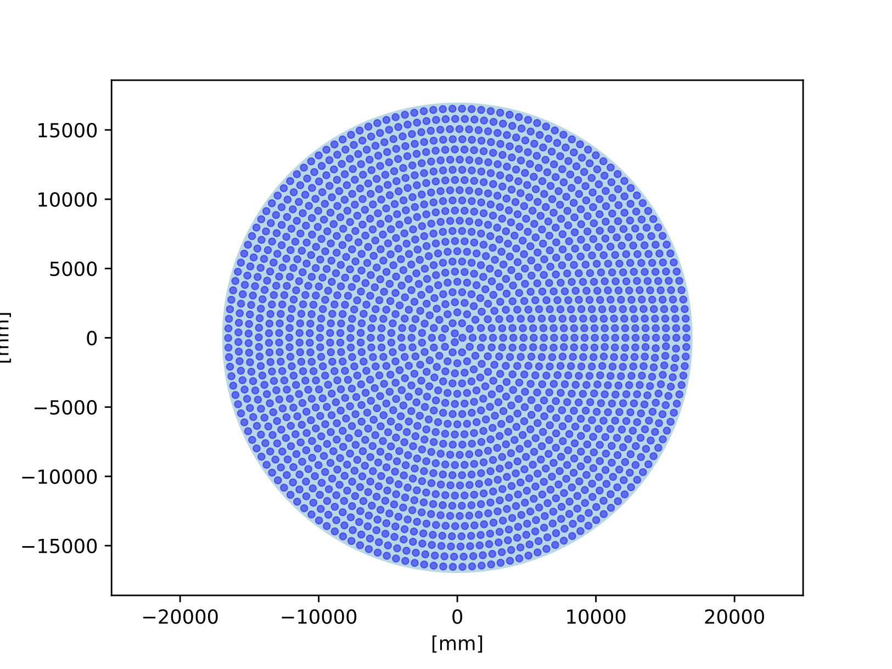
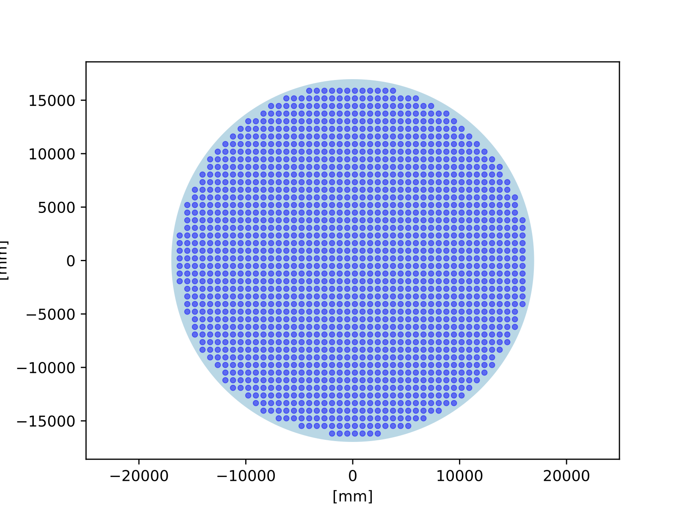
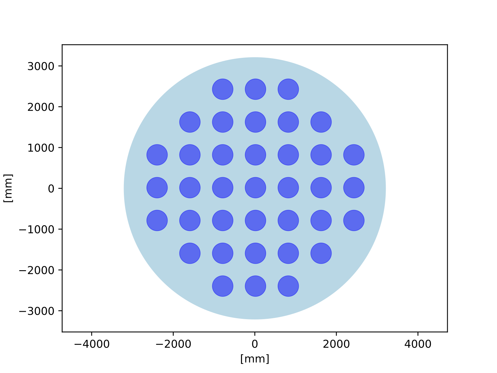
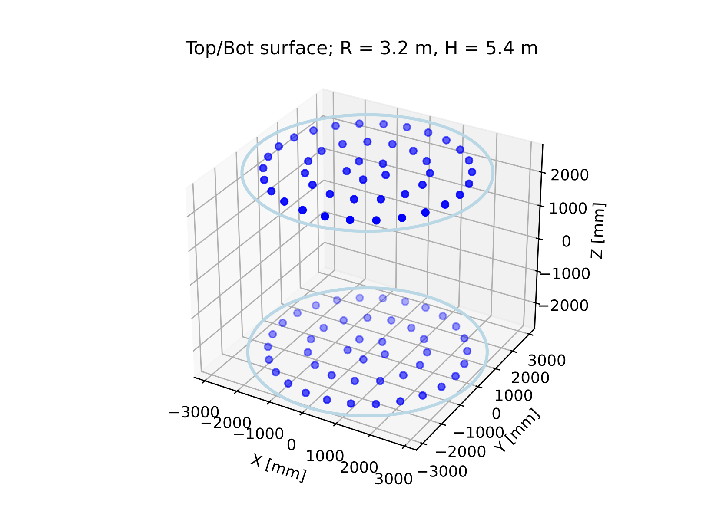
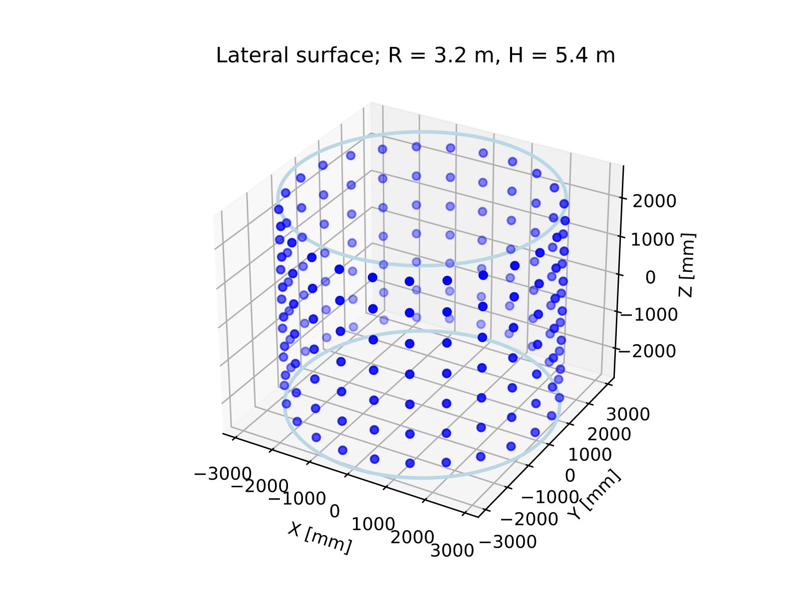
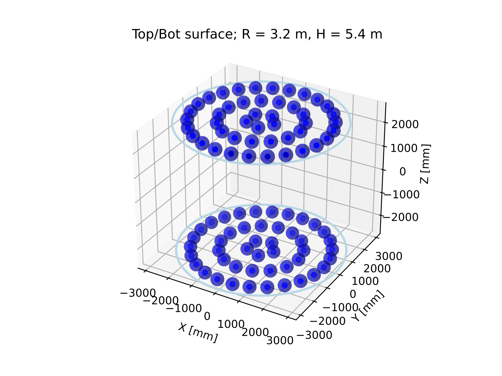
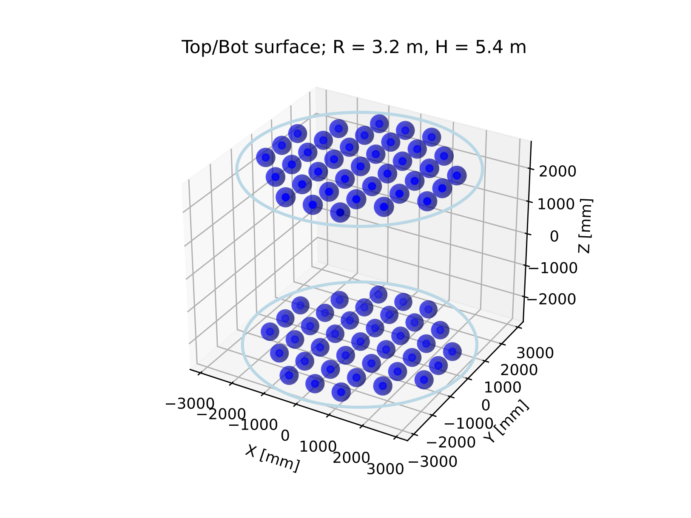
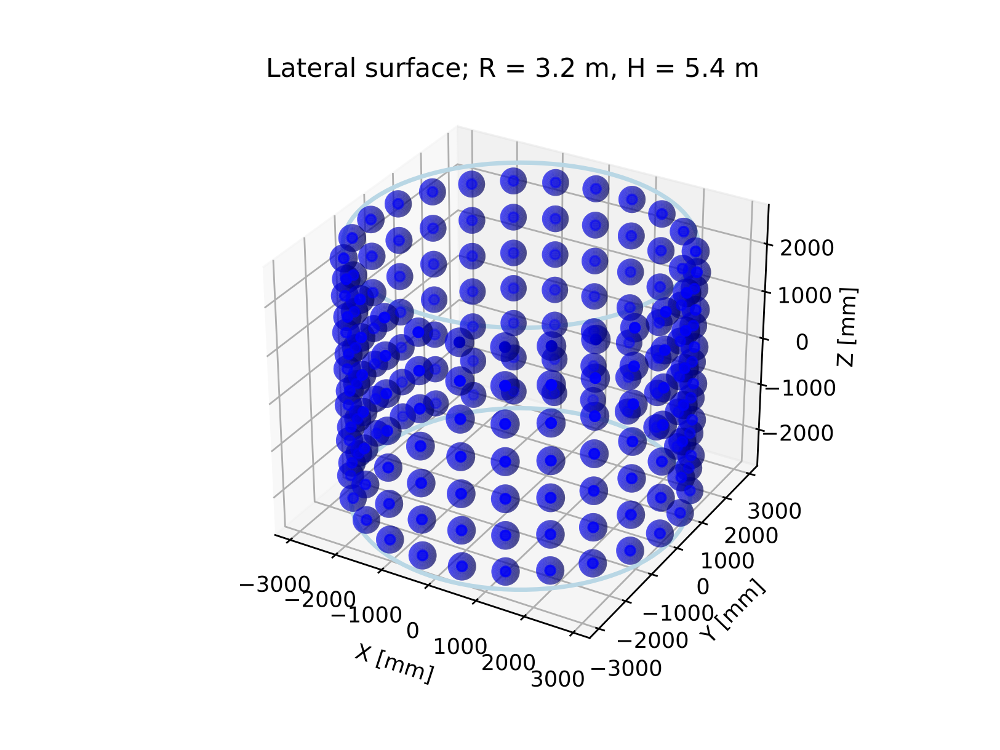

# rp2-cyl-pmtinfo-gen

A Python tool for generating RAT-PAC 2 PMTINFO files for cylindrical detectors with optimized PMT configurations.

## Overview

This tool automates the generation of geometry configuration files for cylindrical detector designs used in neutrino physics experiments. It calculates optimal PMT placement on cylindrical surfaces and endcaps based on requested detector coverage, ensuring no PMT overlap while maximizing coverage efficiency. Endcap PMTs can be placed in two different layouts: circular and grid-like.

## Key Features

- **Coverage-based PMT placement**: Automatically determines the number and position of PMTs based on requested detector coverage
- **Overlap prevention**: Ensures PMTs do not overlap while maintaining optimal spacing
- **Cylindrical geometry support**: Handles both cylindrical barrel surfaces and endcap configurations
- **Visual verification**: Generates plots for visual inspection of PMT layouts
- **RAT-PAC 2 compatibility**: Outputs geometry files in RAT-PAC 2 format
- **Batch processing**: Supports generating multiple configurations efficiently

## How It Works

1. **Input**: Specify detector dimensions (radius, height) and coverage requirements
2. **Calculation**: The tool computes optimal PMT positions ensuring:
   - Desired coverage percentage is achieved
   - PMTs are evenly distributed across surfaces
   - No physical overlap between PMTs
3. **Output**: Generates geometry files and visualization plots for verification
4. **Validation**: Review generated plots to confirm the PMT layout meets requirements

## Requirements

- Python 3.x
- NumPy
- Matplotlib (for visualization)

## Installation

```bash
git clone https://github.com/mattiafani/rp2-cyl-pmtinfo-gen.git
cd rp2-cyl-pmtinfo-gen
```

## Usage

### Basic Usage

Run the main script with the following required parameters:

```bash
python3 py.py --radius <R[mm]> --height <H[mm]> --coverage <fraction>
```

Or use short flags:
```bash
python3 py.py -r <R[mm]> -H <H[mm]> -c <fraction>
```

**Required Parameters:**
- `-r, --radius`: Radius of the cylindrical detector in millimeters
- `-H, --height`: Height of the cylindrical detector in millimeters
- `-c, --coverage`: Desired PMT coverage as a fraction (e.g., 0.30 for 30%)

**Optional Parameters:**
- `--endcaps`: Enable PMT grid on detector endcaps
- `--nice-plots`: Enable enhanced visualization
- `--batch`: Enable batch processing mode
- `-o, --output`: Output directory (default: `output`)
- `--no-plots`: Skip plot generation

### Examples

**Basic detector with 30% coverage:**
```bash
python3 py.py -r 16900 -H 18100 -c 0.30
```

**Detector with endcaps and 40% coverage:**
```bash
python3 py.py --radius 16900 --height 18100 --coverage 0.40 --endcaps
```

**Full configuration with enhanced plots:**
```bash
python3 py.py -r 16900 -H 18100 -c 0.35 --endcaps --nice-plots --batch
```

**Custom output directory:**
```bash
python3 py.py -r 16900 -H 18100 -c 0.30 --output my_detector_config
```

### What the Tool Does

When you run the tool with your parameters, it will:
1. Calculate the number of PMTs needed to achieve your requested coverage
2. Position PMTs optimally to avoid overlap
3. Generate RAT-PAC 2 compatible geometry files
4. Create visualization plots for verification (unless `--no-plots` is specified)
5. Display a summary of the generated configuration

## File Structure

- `py.py`: Main script for geometry generation
- `generate_pmt_positions.py`: Core logic for calculating PMT positions with overlap prevention
- `utils.py`: Utility functions for geometry calculations
- `store_info.py`: Data storage and output file generation
- `plot_all.py`: Comprehensive visualization of detector geometry
- `plot_cylinder.py`: Cylindrical surface visualization
- `plot_open.py`: Open detector view visualization
- `plot_rectangle.py`: Flat projection visualization

## Output

The tool generates:
- **PMTINFO file**: RAT-PAC 2 configuration file with PMT positions
- **PMT coordinates**: Complete list of PMT types, positions and orientations
- **Visualization plots**: Multiple views for visual verification of PMT layout
  - 3D detector view
  - Cylindrical surface unwrapping
  - Endcap layouts
  - PMT distribution analysis

## Visualization and Verification

After running the tool, review the generated plots to verify:
- PMTs are evenly distributed across the detector surface
- No PMT overlap occurs
- Coverage meets your requirements
- Endcap PMT arrangements

## PMT Placement Algorithm

The tool uses an intelligent placement algorithm that:
1. Calculates required PMT density based on coverage requirements
2. Distributes PMTs uniformly across cylindrical and endcap surfaces
3. Checks for and prevents any PMT overlap
4. Optimizes spacing for maximum coverage efficiency

## PMT Positioning Overview

<p align="center">
  <br>
  <em>Lateral surface, Detector size: r = 16.9 m, H = 36.2 m; PMT radius = 254.0 mm. Shown: 7599 PMTs over 10931 total PMTs, 30% coverage</em>
</p>

<p align="center">
  
  
  <em>
    Comparison of the two endcap styles. Detector size: r = 16.9 m, H = 36.2 m; PMT radius = 254.0 mm. Shown: 2x1666 PMTs over 16900 total PMTs, 30% coverage
  </em>
</p>


<p align="center">
  <br>
  <em>Lateral surface, Detector size: r = 3.2 m, H = 5.4 m; PMT radius = 254.0 mm. Shown: 175 PMTs over 249 total PMTs, 40% coverage</em>
</p>

<p align="center">
  
  
  <br>
  <em>
    Comparison of the two endcap styles. Detector size: r = 3.0 m, H = 5.4 m;
    PMT radius = 254.0 mm. Shown: 2×48 PMTs over 249 total PMTs, 40% coverage.
  </em>
</p>

<p align="center">
  
  
  
  <br>
  <em>
    3D views lateral and endcap surfaces of a r = 3.0 m, H = 5.4 m detector with 40% coverage, PMT radius = 254.0 mm. 
  </em>
</p>

<p align="center">
  
  
  
  <br>
  <em>
    3D views lateral and endcap surfaces of a r = 3.0 m, H = 5.4 m detector with 40% coverage, PMT radius = 254.0 mm. PMT dimensions are on scale with the detector size
  </em>
</p>

## License

This project is licensed under the GNU General Public License v2.0 - see the [LICENSE](LICENSE) file for details.

## Contributing

Contributions are welcome! Please feel free to submit issues or pull requests.

## Contact

For questions or support, please open an issue on the [GitHub repository](https://github.com/mattiafani/rp2-cyl-pmtinfo-gen).

## Acknowledgments

This tool is designed for use with RAT-PAC 2 (Reactor Analysis Tool - Physics Analysis in C++), a simulation framework used in neutrino detector experiments.